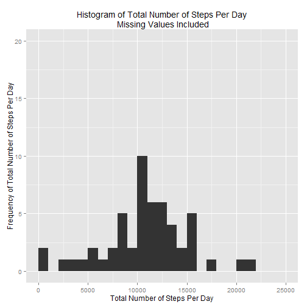

##Assignment


```r
#set working directory in R to folder with database files

act <- read.csv("activity.csv")

head(act)
```

```
##   steps       date interval
## 1    NA 2012-10-01        0
## 2    NA 2012-10-01        5
## 3    NA 2012-10-01       10
## 4    NA 2012-10-01       15
## 5    NA 2012-10-01       20
## 6    NA 2012-10-01       25
```

```r
library(ggplot2)
library(dplyr)

# Format Date in R

act$dateconverted <- as.Date(act$date, format="%Y-%m-%d")

# Create a data frame grouped by Day column and Summed by Steps column

act1 <- 
     act %>%
     group_by(dateconverted) %>%
     summarise(totsteps = sum(steps))
```

####Histogram of the total number of steps taken each day. This dataset has missing values.


```r
p <- ggplot(act1, aes(x=totsteps)) + geom_histogram(binwidth=1000)

hist<- p + 
     labs(title = "Histogram of Total Number of Steps Per Day\n Missing Values Included") + 
     xlab("Total Number of Steps Per Day") + ylab("Frequency of Total Number of Steps Per Day") + 
     xlim(0,25000) +
     ylim(0, 20)

print(hist)
```

 

```r
#Saves as image file to drive:
#ggsave("Fig1_act.png", plot=hist, scale = 1, width = 8, height = 5, units = c("in"), dpi = 80)
```

####Mean of Total number of steps taken per day


####Median of Total number of steps taken per day


